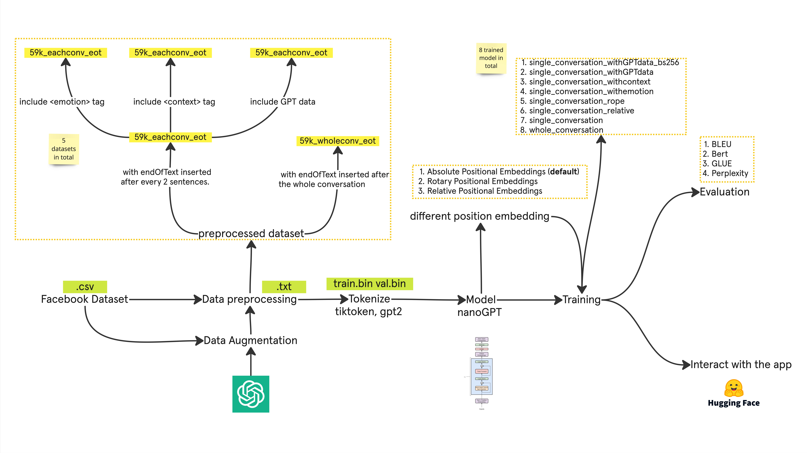

# Empathetic Dialogue System
## About this project
This is a project we developed for the course "Efficient Methods in Machine Learning" at University Hamburg. 
In this project, we trained a small language model from scratch in our local machine (Mostly Apple M1 Pro). We experiment the training with different data, and evaluate and compare the results with BLUE, BertScore, GLEU and Perplexity. 

### The model
Our model is [nanoGPT](https://github.com/karpathy/nanoGPT). We experimented with different position embeddings (ROPE, Relative Positional Embedding, Absolute Positional Embeddings). 

Please check [our model readme](src/nanoGPT/README.md) for the code and detailed 
information. 

### The dataset
We use the [Empathetic Dialogues (Facebook AI) 25k dataset](https://www.kaggle.com/datasets/atharvjairath/empathetic-dialogues-facebook-ai/data) and 
agumented it with data generated by ChatGPT-4o-mini. Please check [our dataset readme](data/README.md) for the code and detailed information. 
## The evaluation and results
We use 10% of the  data to evaluate the models on scores: BLEU , Bert F1, GLUE,Perplexity. The table below is the evaluation result. Check [our evaluation readme](src/evaluation//README.md) for detail explanation.
| Model     | BLEU | Bert F1 |  GLUE | Perplexity |
|--------------------|---------------------|---------------------|---------------------|---------------------|
|single_conversation_withGPTdata_bs256	|0.0062	|0.4865 |	0.3452	|218114.8618
|single_conversation_withGPTdata	|**0.0064**	|**0.8576**|	0.4717|	**28233.3748**
|single_conversation_withcontext	|0.0058	|0.8359	|**0.4588**|	63035.0331
|single_conversation_withemotion	|0.0058	|0.8573	|0.4721	|2008198.4399
|single_conversation_rope	|0.0059|0.4809	|0.3297|	3776063.1443
|single_conversation_relative	|0.0060	|0.3667	|0.3297	|inf
|single_conversation	|0.0059|	0.8568	|0.4727|	84066.9524
|whole_conversation	|0.0055	|0.8481	|0.4360|	29549.3370

## Run the project
## Environment Setup
The IDE we use during development is mainly VSCode.
```
python -m venv env
source env/bin/activate
pip install -r requirements.txt
export PYTHONPATH=/Users/Project-ML/src (copy absolute path to the src folder in your local machine, if you have error like ` No module named 'nanoGPT'`, repeat this step)
```
## Hugging face space
The trained model can be qurried here in the[ hugging face space](https://huggingface.co/spaces/HannahLin271/nanoGPT)

You can also access it locally by first getting [a hugging face token](https://huggingface.co/docs/hub/security-tokens) and 
running:
```
export HF_TOKEN="HF_XXXXXXXXXXXXX"
cd src/app
gradio App.py
```

## Locally train the model

Check the section in [our model readme](src/nanoGPT/README.md).

## Evaluate the model

Check the section in [our model evaluation](src/evaluation/README.md).
