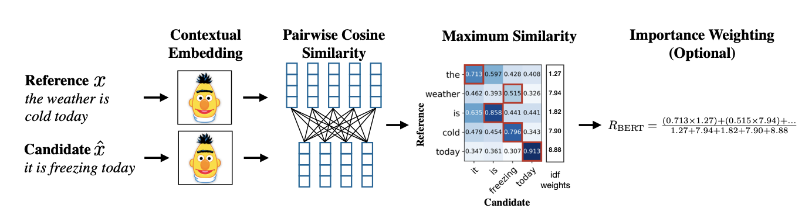

# Evaluation
The **evaluation.ipynb** notebook is designed to evaluate multiple models using different metrics. It aims to identify the best-performing model based on specific criteria

## 1. Data Explanation
The table below describes the different data sources and the corresponding models that were trained on them:

| Data   | Description                                                                                                                                                                                | Trained Model                              |
| :---------------------------- |:--------------------------|-----------------|
| 59k_eachconv_eot              | Under `no_additional_tag` folder. <br />Facebook dataset with `endOfText` inserted after  every 2 sentences.                                                                               |single_conversation, <br/> single_conversation_rope,  <br/>single_conversation_relative  |
| 59k_wholeconv_eot             | Under `no_additional_tag` folder. <br />Facebook dataset with `endOfText` inserted at  the end of the whole conversation.                                                                  | whole_conversation                         |
| 59k_eachconv_eot_with_context | Under `context_tag` folder.<br />Facebook dataset with `endOfText`  <br />After every 2 sentences, including context.                                                                      | single_conversation_withcontext            |
| 59k_eachconv_eot_with_emotion | Under `emotion_file` folder.>Facebook dataset with `endOfText`  <br />After every 2 sentences, including emotion.                                                                          | single_conversation_withemotion            |
| with_gpt_data                 | Under `with_gpt_data` folder.  <br /> Based on  the question in 59k_eachconv_eot, we generated  the answer from ChatGPT 4omini, therefore we have 118k pairs of conversation               | single_conversation_withGPTdata_bs256, single_conversation_withGPTdata_withoutemotion |

## 2. Results
Below are the tables summarizing the scores for each model/evaluation metric combination. The models evaluated are:
- single_conversation
- single_conversation_rope
- single_conversation_relative
- whole_conversation
- single_conversation_withemotion
- single_conversation_withcontext
- single_conversation_withGPTdata_withoutemotion
- single_conversation_withGPTdata_bs256

### 2.1. Small Dataset (Facebook Only)

| Model     | AVG(BLEU) | Bert F1 |  GLUE | Perplexity |
|--------------------|---------------------|---------------------|---------------------|---------------------|
|single_conversation | 0.006294341508914749 | 0.8573648929595947 | 0.51 | 2864.188433546633 |
|single_conversation_rope | 0.006449718067498683 |0.5237810611724854|0.36|138019.7266265564|
|single_conversation_relative | 0.006187011514139771|0.8079032897949219|0.42| 44209813.24339561|
|whole_conversation | 0.005549381274013914 | 0.7825521230697632 | 0.4 | X |
|single_conversation_withemotion | 0.005371129646648176 | **0.8595598340034485** | **0.54** | 937750.794195298 |
|single_conversation_withcontext | 0.0056097142272521225 | 0.8526116013526917 | 0.42 | **2825.1275006949722** |
|single_conversation_withGPTdata_withoutemotion | 0.006452090556086916 | 0.8585449457168579 | 0.48 | 7074.3668454626595 |
|single_conversation_withGPTdata_bs256 | **0.00661592114219667**| 0.5561996102333069 | 0.35 | 24069.64634160262 |


### 2.2. Large Dataset (Facebook + GPT)

| Model                                            | AVG(BLEU)              | BLEU-1                | BLEU-2                 | BLEU-3               | BLEU-4               | Bert F1            | GLUE                  | Perplexity          |
|--------------------------------------------------|------------------------|----------------------|------------------------|----------------------|----------------------|--------------------|-----------------------|---------------------|
| single_conversation                              | 0.00587468362062949    | 0.03303577372298825  | 0.010446828923058333   | 0.007117341692084967 | 0.00587468362062949  | 0.8568010926246643 | **0.4727166374195705** | 84066.95248548205   |
| single_conversation_rope                         | 0.005886990900708465   | --           | --               |--              | --              | 0.48094046115875244| 0.32974011865964736   | 3776063.144329027   |
| single_conversation_relative                     | 0.005992347214885741   | --           | --                | --             | --              | 0.36667502297986126| 0.32974011865964736   | inf                 |
| whole_conversation                               | 0.005539267542303131   | 0.031149590503226302 | 0.009850365417174566   | 0.006710975836043849 | 0.005539267542303131 | 0.8480852246284485 | 0.43603242249519514   | 29549.33700155131   |
| single_conversation_withemotion                  | 0.005846493825725561   | 0.03287725085675706  | 0.010396699591207457   | 0.007083188975867789 | 0.005846493825725561 | 0.8573451042175293 | 0.4721316954959472    | 2008198.4398578384  |
| single_conversation_withcontext                  | 0.005802720584588993   | 0.03263109583247091  | 0.010318858537783629   | 0.007030156483523018 | 0.005802720584588993 | 0.8359043002128601 | 0.45884515751650373   | 63035.03316265359   |
| single_conversation_withGPTdata_withoutemotion   | **0.006432147502200551**| 0.036170623502072514 | **0.011438155465496527** | **0.007792724603294758** | **0.006432147502200551** | **0.8576485514640808** | **0.47171387983621627** | **28233.374812001217** |
| single_conversation_withGPTdata_bs256            | 0.0062091122888948     | 0.034916404327927836 | 0.011041536537961272   | 0.007522511273526714 | 0.0062091122888948   | 0.48648038506507874| 0.34519929806969163   | 218114.86185134976  |


## 3. Metric Descriptions

### 3.1. BLEU (Bilingual Evaluation Understudy)

- Measures **n-gram overlap** (unigrams (BLEU-1), bigrams (BLEU-2), trigrams (BLEU-3), and 4-grams (BLEU-4) )between reference text and model-generated text.
- **Limitation:** Cannot capture long-range dependencies, reordering, or more nuanced semantic elements. 
- BLEU typically ranges from 0 to 1, where:
    - O indicates no overlap at all between the model output and the reference
    - 1 indicates a perfect overlap, the generated text is identical to the reference in terms of n-grams
- Doesn't evaluate if the sequence as a whole makes sense and if it is emotionally aligned with the input
- BLEU does not require a language model because directly compares n-grams (word sequences) between the generated output and reference sentences to assess similarity. It doesn’t rely on the probability distribution of words but rather on the overlap of word sequences.

**BLEU-1**
```
Candidate: "the the the the the the the"
Reference: "The cat is on the mat"
```
Precision: 2/7

**BLEU-2**
```
Candidate: "The quick brown fox"
Reference: "A quick brown fox"
```
Bigrams: ["The quick", "quick brown", "brown fox"]
Matches: "quick brown", "brown fox"
Precision: 2/3

**BLEU-3**
```
Candidate: "The quick brown fox"
Reference: "A quick brown fox jumps"
```
Trigrams: ["The quick brown", "quick brown fox"]
Matches: "quick brown fox" 
Precision: 1/2

**BLEU-4**
```
Candidate: "The quick brown fox"
Reference: "A quick brown fox jumps over"
```
Four-grams: ["The quick brown fox"]
Precision: 0

### 3.2. BERTScore
- Use **contextual embeddings** (e.g. BERT, RoBERTA to assess semantic similarity between generated text and referece)

    We used 'roberta-large' trained on 160GB of text. relies only on MLM (Masked Language Model) for pretraining

- How BERTScore solves the problem of the BLEUScore: 

    For instance, the BLEU score is not severely affected if the phrases are switched from “A because B” to “B because A”, especially when A and B are long phrases. BERTScore's contextual embeddings are trained to recognize order and deal with distant dependencies present in the text.

- In BERTScore, the similarity between two sentences is computed as the sum of the cosine similarities between their token embeddings.
    Cosine similarity measures the cosine of the angle between two vectors in a multi-dimensional space (in this case, the embedding vectors), providing a value between -1 and 1. A score of 1 indicates identical directionality (and thus, maximum similarity), while -1 indicates completely opposite directionality.

- **BERTScore is a measure of orientation and not magnitude**: In natural language processing (NLP), using cosine similarity allows systems to ignore how frequently certain words appear (their vector length) and instead focus on their directionality in semantic space (their meaning in context). For instance, the words “cold” and “chilly” might be represented by vectors of different magnitudes depending on how commonly they appear in a dataset, but their directions would be similar because they have similar meanings.

- Traditional metrics often fail to recognize paraphrases that preserve meaning but differ in wording. BERTScore addresses this by using BERT’s deep contextualized embeddings, which are better at capturing paraphrastic variations.

**Precision**: This measure reflects how much of the candidate text is covered by the reference text. For each token in the candidate text, BERTScore selects the highest cosine similarity score among all reference tokens (greedy matching).
**Recall**: This measure reflects how much of the reference text is covered by the candidate text.
**F1 Score**: The F1 score is particularly useful because it accounts for both the precision and recall of the evaluation, providing a more balanced assessment of similarity.



Source: [link](https://arxiv.org/pdf/1904.09675)

**Example**
```
Reference 1: I feel very sad today
Model Output 1: I feel very happy today
BERTScore Precisiion: 0.9777
BERTScore Recall: 0.9777
BERTScore F1: 0.977
```

### 3.3. Perplexity
- Quantifies the language model'S "surprise" 😮 for a piece of text: lower means the model is **less surprised** ad presumably better at predicting tokens
- Model-dependent: the underlying language model affects perplexity calculation (different language models may assing different probabilities to the same sentence)
- **Limitation**: Low perplexity doesn't necessarily mean high-quality or correct semantic answerrs; it cam be overconfident on incorrect guesses.

### 3.4. GLUE (General Language Understanding Evaluation)
GLUE, also known as General Language Understanding Evaluation, is an evaluation benchmark designed to measure the performance of language understanding models in a range of natural language processing (NLP) tasks.

GLUE has different possible tasks. For the purpose of our project maybe this one is the most interesting: SST-2 (Sentiment Analysis). Stanford Sentiment Treebank 2. Sentiment classification (positive or negative) of sentences.

Compares model-generated sentiments against reference sentiments for a dataset. In our pipeline we used an **emotion classifier** that uses the model bhadresh-savani/distilbert-base-uncased-emotion from Hugging Face’s Transformers library. 

**How to use**

There are two steps: (1) loading the GLUE metric relevant to the subset of the GLUE dataset being used for evaluation; and (2) calculating the metric.

1. **Loading the relevant GLUE metric** : the subsets of GLUE are the following: `sst2`,  `mnli`, `mnli_mismatched`, `mnli_matched`, `qnli`, `rte`, `wnli`, `cola`,`stsb`, `mrpc`, `qqp`, and `hans`.

More information about the different subsets of the GLUE dataset can be found on the [GLUE dataset page](https://huggingface.co/datasets/glue).

2. **Calculating the metric**: the metric takes two inputs : one list with the predictions of the model to score and one lists of references for each translation.

The metrics we use : bhadresh-savani/distilbert-base-uncased-emotion. Supported Classes: Joy, Anger, Sadness, Fear, Surprise, Love, Neutral
**SST-2** (Standfrod Sentiment Treebank 2)  Classifying a sentence as having positive or negative sentiment

## Conclusion

The model **single_conversation_withGPTdata_withoutemotion** performs the best in all evaluation metrics besides GLUE.

- **Metric Insigths**:
The evaluation highlights the strengths and limitations of each metric:
- **BLEU** offers a quick n-gram overlap assessment but lacks depth in semantic evaluation, necessary for an empathetic dialogue system
- **BERTScore** provides a deeper look at semantic similarities.
- **Perplexity** offers insights into model confidence but not necessarily semantic correctness.
- **GLUE** provides a comprehensive benchmark across multiple linguistic tasks.

For deeper insight into relevance, coherente, and empathy, we could think of **human evaluation**.


